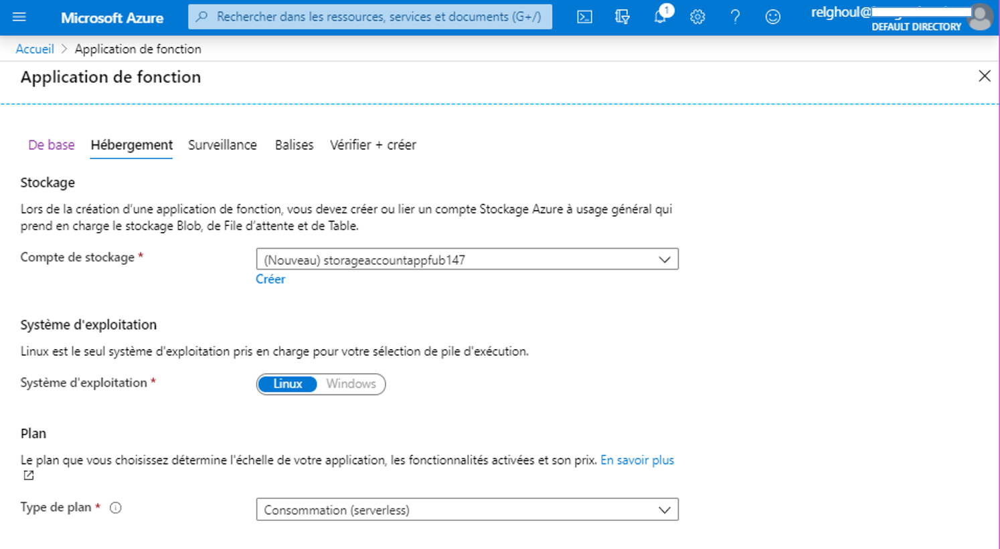

# Azure-Function-service-Demo
Azure-Function-service-Demo (serverless application)
Purpose: Create and deploy an Azure function.
Function app is event driven. The execution of function caused by an event.
The configuration of a function must be with exacltly one trigger.
# Requirements
- Azure portal (https://portal.azure.com/learn.docs.microsoft.com).
- Programming Language (Python | JavaScript | PowerShell | Java).
# Steps
- Connet to azure portal (https://portal.azure.com/learn.docs.microsoft.com) with a valid subscription.

- Create a Resource -> Compute ->  Function app

- Configure your service and choose storage resource.

To add code with python , we need to install visual studio code and follow the configuration instrutions on your local machine. (this step can be done from CLI).
- Deploy from VS Code your code on Azure (need to sign in from VS code Azure Plugin).

- Run Trigger service from dashboard.

- Test Trigger App service (In my case, I'am using Postman (https://www.postman.com/) as HTTP Client for testing).

References:
-https://docs.microsoft.com/en-us/azure/azure-functions/functions-overview
